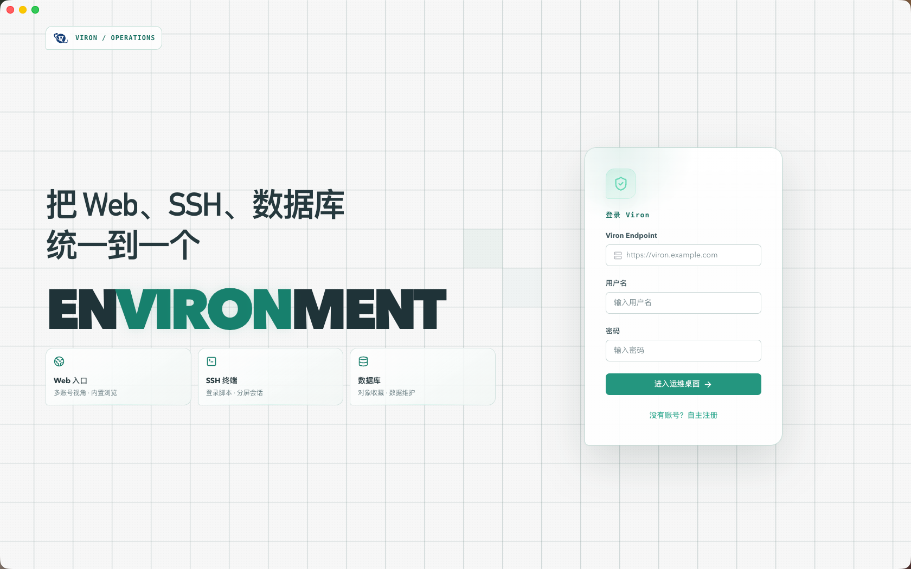
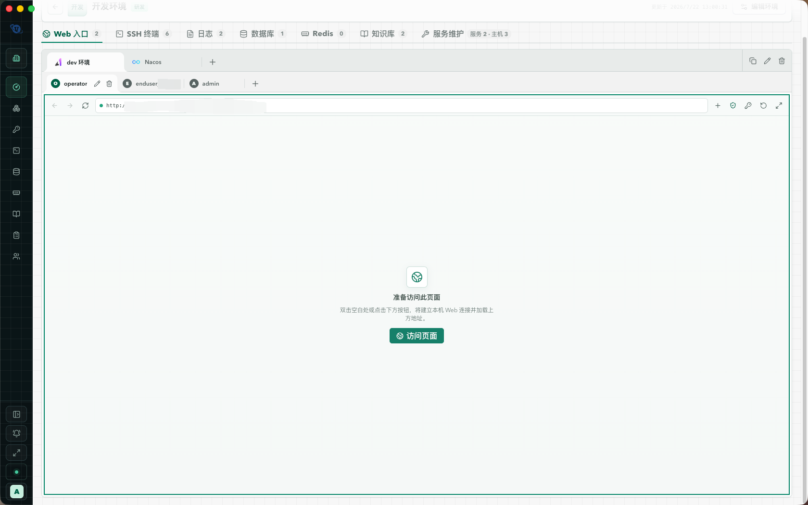
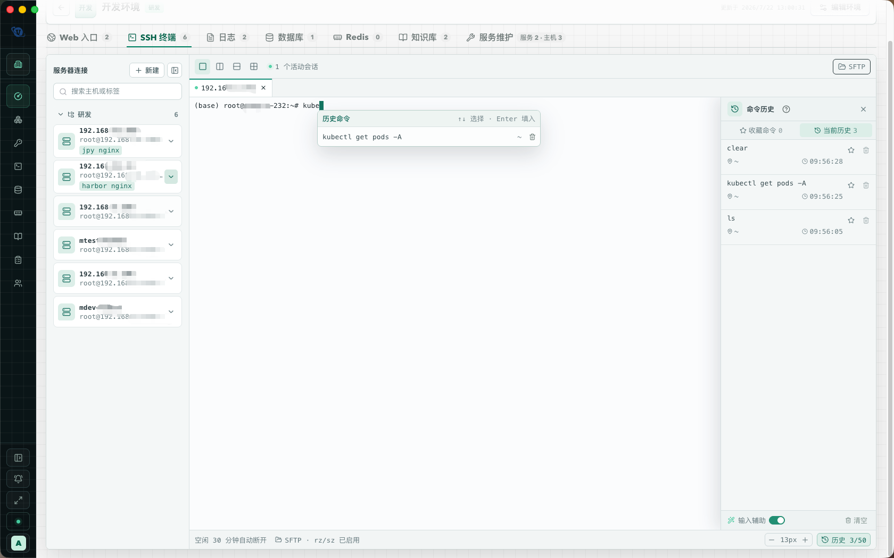
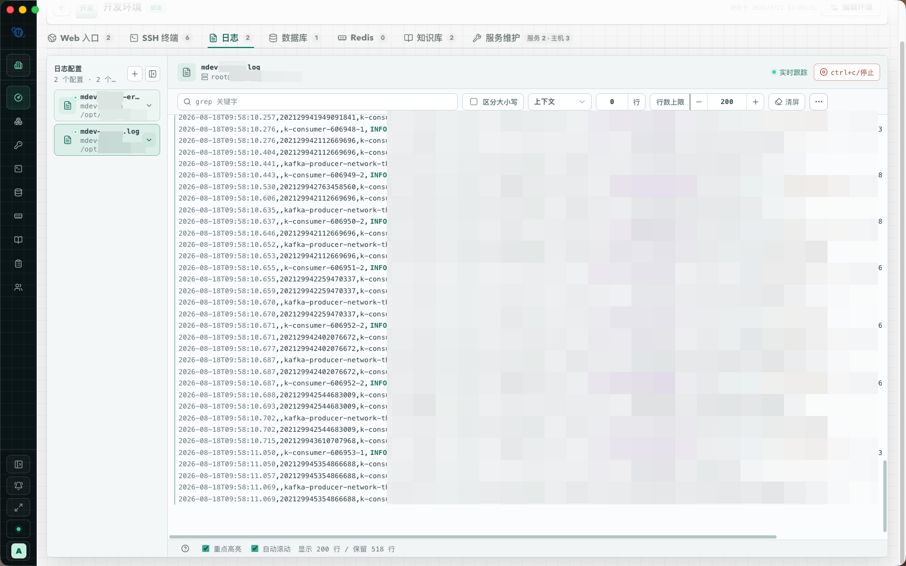

<p align="center"></p>

<h1 align="center">Viron</h1>

<p align="center">
  <a href="./README.md">简体中文</a> · <a href="./README.en.md">English</a>
</p>

<p align="center">
  An all-in-one workbench for development and operations<br />
  <a href="./LICENSE"></a>
  
</p>

Viron keeps a website, SSH hosts, MySQL / MariaDB, Redis, host monitoring, and an Agent in one environment. The goal is to stop jumping between a terminal, a database client, a browser, and a jump host. Organizations, project groups, and resource grants control who can enter which environment. Audit events, terminal recordings, and SQL history show who did what.

<p align="center"></p>

## Server, Web client, and desktop App

Viron is one product with three pieces. They share the same accounts, workspaces, environments, and encrypted credentials. They are not three independent tools.

```text
                         Viron Server
              accounts · permissions · credentials
                   audit · environments
                            │
           ┌────────────────┴────────────────┐
           │                                 │
    Full edition only                  Lite or Full
   static UI + Chromium                 API / WebSocket
           │                                 │
     Web client                        Desktop App
   (any browser)                    (macOS / Windows)
   traffic leaves                    local by default,
   from the server                   or via the server
```

**Server** is the control plane. It stores users, organizations, environments, encrypted secrets, and audit records. Every Web session and every App login talks to one server Endpoint. The server has two editions:

| Edition | What it includes | What it does not include |
| --- | --- | --- |
| **Full** | API, WebSocket, the Web UI, Chromium for target websites, and server-side forwarding for SSH / SFTP / logs / database / Redis | Nothing required for browser use |
| **Lite** | API, credential grants, and server-side forwarding for SSH / SFTP / logs / database / Redis | The Web UI and Chromium. Open it from the App, not from a browser. |

**Web client** is the UI served by a Full server. Open the server URL in a browser. No install is required. Target SSH, database, Redis, logs, and website sessions are opened **on the server**. Website pages run in server-side Chromium. Use this when you want a single egress path and no local client.

**Desktop App** is the same workbench, packaged for macOS 12+ and Windows. In the App you enter a Viron Endpoint (Lite or Full). Target connections default to **this computer**. You can switch supported protocols to server forwarding when the machine cannot reach the target. If the server cannot proxy websites (Lite, or Full without that capability), the App still opens those pages with local Chromium. The App also hosts native overlays, local MCP, and system notifications.

| | Web client | Desktop App |
| --- | --- | --- |
| How you open it | Browser → Full server URL | Install the App → enter the Endpoint |
| Works with | Full server | Lite or Full server |
| Where target traffic starts | Always the server | This computer by default; optional server forwarding |
| Website pages | Server Chromium | Local Chromium, or server Chromium when Full forwarding is available |
| Typical fit | No install, shared egress | Direct LAN access, or mixed local / forwarded paths |

The workbench itself is shared. Switching between Web and App does not create a second product, only a different place for the connection to start.

## Features

- **Web browser.** Save several login accounts per site and open them together. Sessions stay isolated, so you do not keep switching account views while developing.
- **SSH terminal.** Real sessions with login scripts, command history, and favorites. Also includes dual-pane SFTP and in-browser `rz` / `sz`.
- **Database.** The MySQL / MariaDB workbench covers about 70% of day-to-day Navicat work: object tree, SQL, table design, data grid, import / export, and sync.
- **Redis.** The Standalone workbench covers the usual cases: key browsing, the six core types, TTL, and guarded commands.
- **Monitoring.** Install `viron-monitor` over the existing SSH path, collect host metrics, and raise alerts when something is wrong.
- **Agent.** The built-in assistant can read the current environment and, after confirmation, operate on it. Viron also exposes MCP so other agents can use the same capabilities.
- **Organizations and audit.** Personal spaces, organizations, project groups, and grants enforce internal data access. Operations, terminal recordings, and SQL history are attributable per member.

## Screenshots

These shots come from a real workspace. Internal details are heavily mosaicked.

**Environment overview** — Group environment cards and see Web, SSH, database, and Redis resources.

<p align="center"></p>

**Web entries** — Several accounts on the same site, with isolated sessions.

<p align="center"></p>

**SSH terminal** — Login scripts, command history, SFTP, and `rz` / `sz`.

<p align="center"></p>

**Live logs** — Follow several files over SSH, with filter, highlight, and context.

<p align="center"></p>

**Database** — MySQL / MariaDB object tree, queries, and table data.

<p align="center"></p>

**Monitoring** — One-click collector install, host status, and alerts.

<p align="center"></p>

## Quick start

Docker 24 and Docker Compose v2 are required. Current release: **0.1.6**.

```bash
cp .env.example .env
```

Edit `.env` and change the first admin password. Start the Full server:

```bash
docker compose -f docker-compose.full.yml up -d --build
```

Open `http://127.0.0.1:8080` in a browser. Health check: `GET /healthz` on the same origin.

If you only need the desktop App and do not want the browser UI:

```bash
docker compose -f docker-compose.lite.yml up -d --build
```

Keep `ALLOW_WEAK_PASSWORDS=false` in production. Leave `COOKIE_SECURE=false` for plain HTTP; set it to `true` behind an HTTPS reverse proxy. Metadata defaults to SQLite under `DATA_DIR`, or you can point it at MySQL 8+ / MariaDB 10.6+.

Desktop clients support macOS 12+ (Apple Silicon and Intel) and Windows (x86 / x64 / arm64). Deployment, migration, backup, and installer details are in the [user guide](./docs/USER-GUIDE.md).

## Local development

Node.js 22.19+ is required.

```bash
npm ci
cp .env.example .env
./scripts/dev-service.sh start
```

API: `http://127.0.0.1:8080`. With the Web client enabled, the dev UI is `http://127.0.0.1:5173`.

```bash
npm run typecheck
npm test
npm run build
```

## Documentation

| Document | Contents |
| --- | --- |
| [User guide](./docs/USER-GUIDE.md) | Features, operating paths, and administration (Chinese) |
| [Technical design](./TECHNICAL-DESIGN.md) | Architecture, security boundaries, and acceptance (Chinese) |
| [MCP](./docs/MCP.md) | Remote and local MCP access (Chinese) |
| [Script sync](./docs/SCRIPT-SYNC.md) | Isolated script-sync contract (Chinese) |
| [Roadmap](./docs/ROADMAP.md) | Unshipped directions (Chinese) |
| [Security policy](./SECURITY.md) | Vulnerability reporting |

## Security

Passwords, private keys, cookies, and TLS material are stored with AES-256-GCM. The instance master key is created in the data directory with mode `0600`. MCP is off by default and never returns saved secrets in tool arguments or results.

Do not commit `.env`, `data/`, or `secrets/`. Report vulnerabilities privately as described in [SECURITY.md](./SECURITY.md).

## License

Viron is released under the [Apache License 2.0](./LICENSE). Third-party notices are in [NOTICE](./NOTICE) and [monitor/THIRD_PARTY_NOTICES.md](./monitor/THIRD_PARTY_NOTICES.md).

Navicat is a trademark of PremiumSoft CyberTech Ltd. SecureCRT is a trademark of VanDyke Software, Inc. Viron is not affiliated with those products. Import and protocol compatibility are independent implementations.
